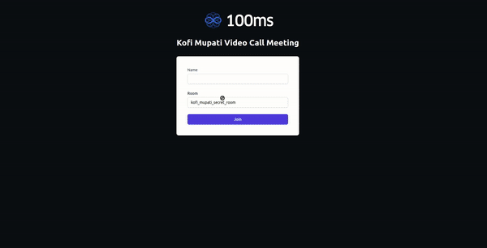
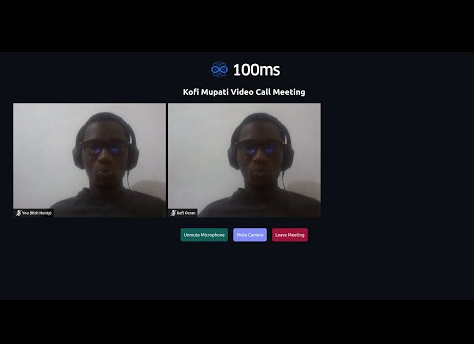

# vue-golang-video-chatapp

> Video Chat App with Vuejs and Golang hosted on 100ms

A video call application using the [100ms.live](https://100ms.live) platform.

`TypeScript`, `Vuejs`, `Netlify` Functions in `Golang`

---

---

---

&copy; 2024 @codeguru827

All rights reserved.
